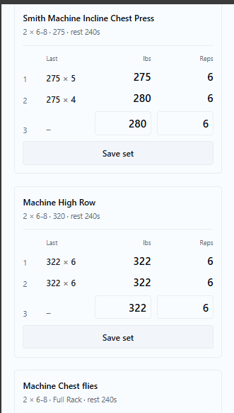

# TrainerOS

**Workout programming and logging for a personal trainer and their clients.** Trainers build
per-client programs in real coaching language on a phone between sessions; clients log each set
beside what they lifted at that position last session. That inline last-time number is the
feature the product is built around — it competes with a paper notebook, not with other apps.

Live at **[traineros.me](https://traineros.me)**.



**Stack:** ASP.NET Core 8 minimal APIs · EF Core 8 + Npgsql · PostgreSQL · React 19 +
TypeScript + Vite + Tailwind 4 · Azure Functions (.NET isolated worker) · Azure Queue Storage ·
Resend. Auth is hand-rolled sessions and magic links rather than ASP.NET Identity — see
[architecture.md](docs/architecture.md) for why, and what was rejected.

## How it fits together

One App Service serves the API **and** the built SPA out of the same `wwwroot`. That makes the
session cookie first-party with zero CORS surface, which is why the Vite dev server proxies
`/api` instead of running a second origin.

A separate Function App runs the reminder pipeline: `ReminderScheduler` (15-minute timer) reads
schedules from Postgres and enqueues to Azure Queue Storage; `ReminderWorker` renders and sends
the email; `ReminderPoisonHandler` performs last rites on anything that fails five times. Both
hosts share `TrainerOS.Domain`, so background code renders email from the same entities and the
same scoped-query rules as the API — a worker that queries unscoped would be the same IDOR with
no URL.

## The specs

This repo is spec-driven: the design decisions were written down before the code, and they are
the source of truth for it.

| Document | What it covers |
|---|---|
| [PRODUCT.md](PRODUCT.md) | v1 scope, non-goals, and the Definition of Shipped — the boundary of what gets built |
| [DESIGN.md](DESIGN.md) | the visual system: OKLCH tokens, typography, layout, absolute bans |
| [docs/architecture.md](docs/architecture.md) | stack, deployment shape, repo layout, non-goals |
| [docs/database.md](docs/database.md) | schema |
| [docs/api.md](docs/api.md) | routes and the authorization model |
| [docs/notifications.md](docs/notifications.md) | the reminder pipeline |
| [docs/ui-ux.md](docs/ui-ux.md) | screens |
| [docs/deploy-config.md](docs/deploy-config.md) | Azure resources, app settings, pipeline secrets, deploy gotchas |

`docs/ui-ux.md` governs scope — what gets built. `DESIGN.md` governs taste within it — how it
looks. Where they conflict, ui-ux.md wins.

## Testing

Both suites run offline — no Postgres, no Azurite, no network. That is why the deploy pipeline
runs them in the deploy path rather than trusting that someone ran them locally.

```sh
dotnet test                 # API + domain; SQLite in-memory
npm test --prefix src/web   # client; Vitest + React Testing Library on jsdom
```

The tests worth looking at first are the **client-isolation** ones. Every client-facing route has
an integration test that authenticates as client A, requests client B's resource, and asserts 404
— mandatory per [api.md](docs/api.md) §Authorization model rule 5, and a route without one is not
considered done. They live beside each resource's own tests rather than in one file, because the
rule is a property of every route, not a suite you can finish.

A tripwire test in `ScopedQueryExtensionsTests.cs` guards the data-access boundary: it asserts by
reflection that the context exposes no public `DbSet` of an owned entity type, so queries have to
go through the scoped extensions (`{Entity}ForTrainer(id)` / `{Entity}ForClient(id)`) and the
scoping cannot be forgotten per-handler.

The client suite pins its timezone to UTC, because a test asserting that dates resolve against
`users.timezone` rather than the browser's zone passes for free on a developer sitting in that
timezone.

## Deployment

Push to `main` fires **two** pipelines, deliberately split — a CSS tweak has no business
restarting the scheduler, and a timer change has no business waiting on the client test suite:

| Workflow | Deploys | Migrations |
|---|---|---|
| [`deploy-app.yml`](.github/workflows/deploy-app.yml) | API + built SPA → one App Service | **Owns the schema, alone** |
| [`deploy-functions.yml`](.github/workflows/deploy-functions.yml) | Function App (scheduler, worker, poison handler) | **Never touches it** |

`deploy-app.yml` runs `build → migrate → deploy` in that order. It builds and tests both halves,
copies the Vite output into the API's `wwwroot`, then applies EF migrations as a self-contained
bundle — and only then deploys. Migrations gate the deploy: a failed migration exits non-zero and
deploy never runs, rather than shipping code that assumes it applied. It finishes with a smoke
check that `/api/health` reports `connected` and that `/` returns the SPA shell rather than the
API's JSON 404.

**One migrator is a rule, not a lock.** EF Core 8 takes no migration lock (that arrived in EF 9),
so two bundles against one database would both read `__EFMigrationsHistory`, both decide the same
migration is pending, and one would die mid-DDL. The two workflows therefore use separate
concurrency groups and `deploy-app.yml` is the only one that migrates. The window where Functions
deploys against the old schema is absorbed by the queue: the worker throws, the message retries,
and `maxDequeueCount` 5 gives it four more chances after the schema lands.

The environment is live at [traineros.me](https://traineros.me): one App Service (B1,
`canadacentral`) serving the API and the SPA, a Function App on the same plan, and Neon Postgres.
Resources, app settings, the GitHub secrets the pipeline needs, and the deploy gotchas worth
reading before touching any of it are in [docs/deploy-config.md](docs/deploy-config.md).

## Local development

Everything below runs with **no Azure account**.

**Prerequisites:** [Docker Desktop](https://www.docker.com/products/docker-desktop/),
[.NET 8 SDK](https://dotnet.microsoft.com/download/dotnet/8.0),
[Azure Functions Core Tools v4](https://learn.microsoft.com/azure/azure-functions/functions-run-local),
[Node.js](https://nodejs.org/).

### 1. Start local services

```sh
docker compose up -d
```

Postgres 16 on 5432, Azurite on 10000–10002. Local credentials are `traineros`/`traineros`,
database `traineros` — dev-only values wired into `appsettings.Development.json`, not secrets.

### 2. Create the schema

Nothing migrates on startup — migrations are a pipeline step, never a boot step, because startup
migrations race across instances. Apply them yourself:

```sh
dotnet tool restore
dotnet dotnet-ef database update --project src/TrainerOS.Domain --startup-project src/TrainerOS.Api
```

`dotnet-ef` is a local tool pinned in `.config/dotnet-tools.json`, so `dotnet tool restore` comes
first or the second command is a "command not found". Confirm it landed:

```sh
dotnet dotnet-ef migrations list --project src/TrainerOS.Domain --startup-project src/TrainerOS.Api
```

Every migration should be listed without a `(pending)` marker. Three exist today.

### 3. Run the API

```sh
dotnet watch --project src/TrainerOS.Api
```

`GET http://localhost:5216/api/health` returns `200 {"database":"connected"}`.

**That proves the database is reachable, not that it is migrated.** It runs `SELECT 1`, which
succeeds against a completely empty database — so it answers `connected` even if you skipped step
2, and then every real endpoint fails. It is a liveness probe for the deploy pipeline's smoke
check, where the schema is the migrate job's business. Locally, trust `migrations list` for the
schema and `/api/health` only for the connection.

### 4. Create a trainer account

A fresh database has no users and there is no sign-up screen — the first trainer comes from
configuration. Set both values and the API seeds the account once at startup:

```sh
dotnet watch --project src/TrainerOS.Api \
  --Seed:TrainerEmail you@example.com --Seed:TrainerPassword "choose-a-dev-password"
```

Seeding is idempotent: if any trainer already exists it is a no-op, and a re-run with a different
password is not a reset. Setting only one of the two is a startup failure rather than a
half-configured boot. After the first run, drop both flags.

Both sides are reachable from one clone: seed yourself as the trainer, add a client in the app,
then sign in as that client using the magic link the console sender writes to the API's terminal.

### 5. Run the Functions host

`src/TrainerOS.Functions/local.settings.json` is gitignored. Create it with:

```json
{
    "IsEncrypted": false,
    "Values": {
        "AzureWebJobsStorage": "UseDevelopmentStorage=true",
        "FUNCTIONS_WORKER_RUNTIME": "dotnet-isolated",
        "AZURE_FUNCTIONS_ENVIRONMENT": "Development",
        "App:BaseUrl": "http://localhost:5173",
        "Notifications:PauseTokenKey": "dev-only-pause-token-signing-key-not-for-production"
    },
    "ConnectionStrings": {
        "Postgres": "Host=localhost;Port=5432;Database=traineros;Username=traineros;Password=traineros"
    }
}
```

`Notifications:PauseTokenKey` signs the pause link in every reminder footer and **must match the
API's** — the API validates what this host signs, so a mismatch makes every pause link look
forged. All four values are required; the host refuses to start without them rather than failing
silently at the first send.

```sh
cd src/TrainerOS.Functions
func start
```

`ReminderScheduler` runs on a 15-minute timer and creates the `reminders` queue in Azurite on its
first enqueue. In Development the worker logs email to stdout — outside Development it binds
Resend and refuses to start without `Resend:ApiKey` / `Resend:From`.

### 6. Run the web client

```sh
cd src/web
npm install
npm run dev
```

Vite serves on http://localhost:5173 and proxies `/api` to port 5216. After any endpoint or DTO
change, run `npm run generate:types` — it builds the API, exports `openapi.json`, and regenerates
`src/web/src/api/types.gen.ts`. DTOs are never hand-duplicated.